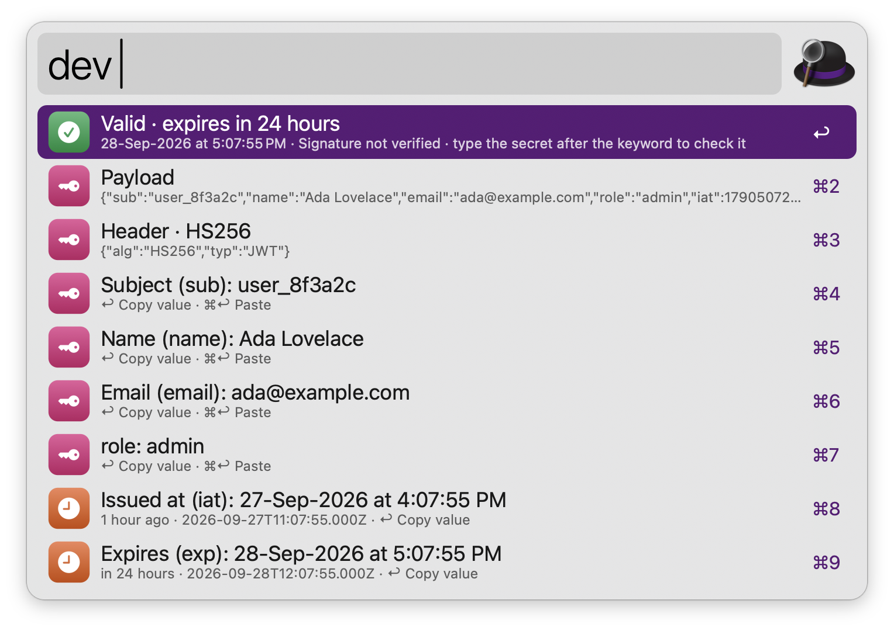
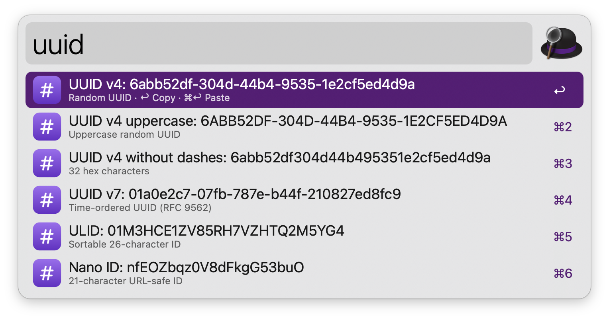
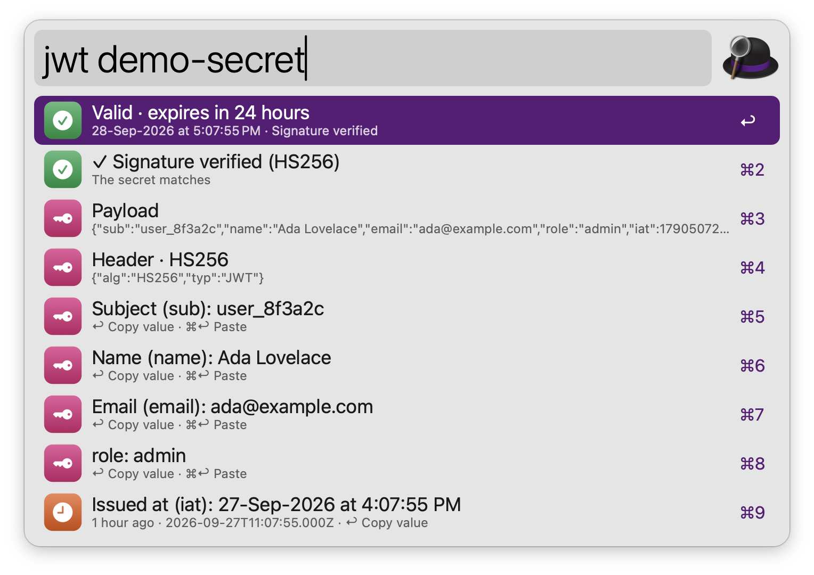
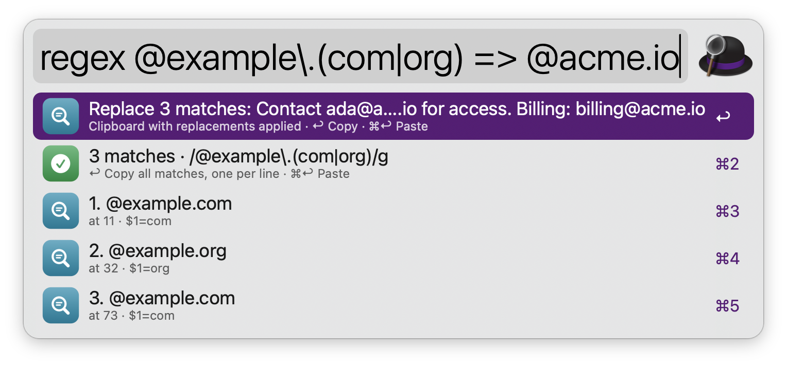
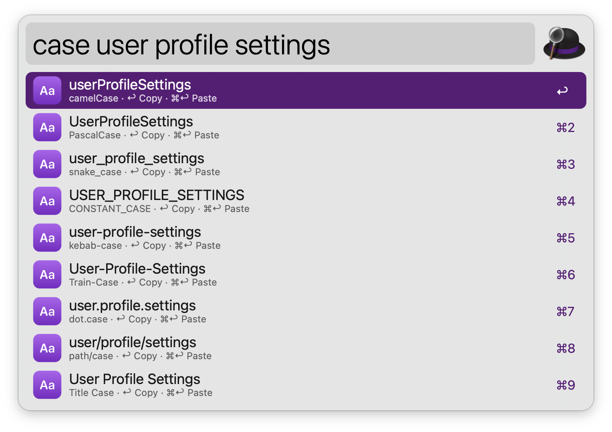
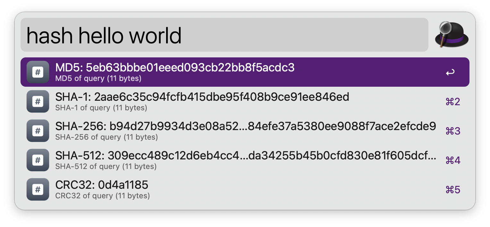
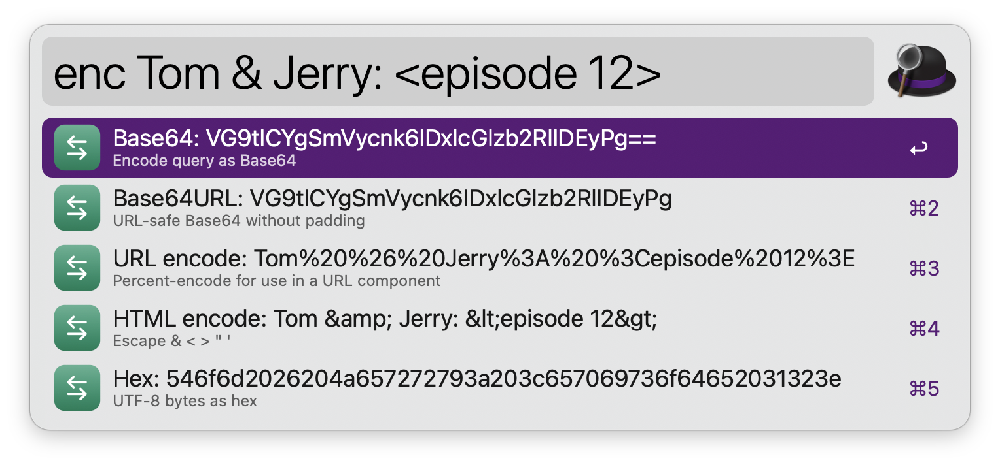
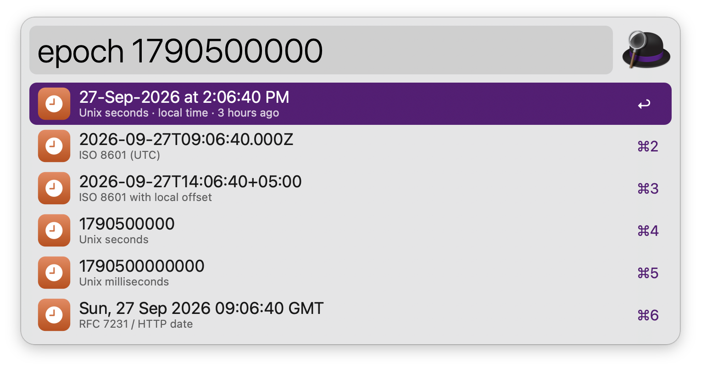
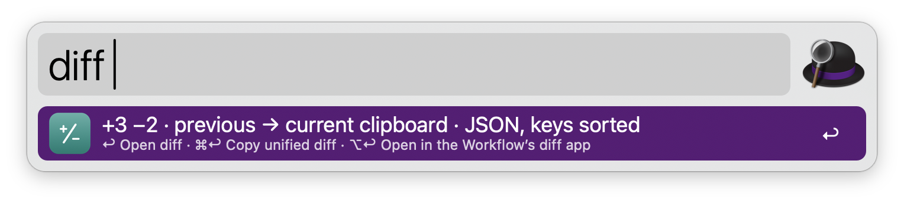

#  DevToolbox

Everyday developer transforms in Alfred: format JSON, generate UUIDs, decode JWTs, test regular expressions, hash, encode, convert timestamps and diff text. No dependencies: everything runs on tools that ship with macOS.

## Usage

Transform whatever is in the clipboard via the `dev` keyword. DevToolbox detects JSON, JWTs, timestamps and dates, and always offers encodings and hashes. Type text after the keyword to use it instead of the clipboard.



Alternatively, transform selected text via the Universal Action.

* <kbd>↩</kbd> Copy the result.
* <kbd>⌘</kbd><kbd>↩</kbd> Paste the result into the frontmost app.
* <kbd>⌘</kbd><kbd>C</kbd> Copy the result without closing Alfred.
* <kbd>⌘</kbd><kbd>L</kbd> Show the result in Large Type.

The same keys work in every tool below.

### JSON

Pretty print, minify, sort keys, generate TypeScript interfaces, or convert to JSON Lines or CSV via the `json` keyword. It also fixes JavaScript-style objects (unquoted keys, single quotes, trailing commas) and converts CSV to JSON. Type `min`, `sort` or `ts` to jump to an action, or paste JSON after the keyword.


### IDs

Generate a UUID v4, UUID v7, ULID or Nano ID via the `uuid` keyword. Start with a number to generate several, one per line, like `uuid 10 v7`.



### JWT

Decode a JSON Web Token from the clipboard via the `jwt` keyword: see whether it has expired, its header, payload and every claim, with dates in local time. The signature is not verified.



### Regular Expressions

Test a regular expression against the clipboard via the `regex` keyword. Write `/pattern/flags` to set flags, and add ` => replacement` to replace matches (`$1` and `$<name>` refer to groups).



* <kbd>↩</kbd> on the summary row copies every match, one per line.

### Case

Convert text to camelCase, PascalCase, snake_case, CONSTANT_CASE, kebab-case, Title Case, Sentence case and more via the `case` keyword.



### Hashes

Get the MD5, SHA-1, SHA-256, SHA-512 and CRC32 of the clipboard or typed text via the `hash` keyword.



Alternatively, hash a file via the Universal Action. Copy the checksum from a download page first to see whether the file matches.

### Encoding

Encode or decode Base64, Base64URL, URL encoding, HTML entities, hex, backslash escapes and Unicode escapes via the `enc` keyword. Decoding options appear when the text is encoded, and numbers are converted between decimal, hex, binary and octal.



### Timestamps

Convert Unix timestamps (seconds, milliseconds, microseconds or nanoseconds) and dates via the `epoch` keyword. Leave it empty for the current time.



### Diff

Compare the last two text entries of Alfred’s Clipboard History via the `diff` keyword. JSON is compared with its keys sorted, so only real changes show.



Alternatively, compare two selected files via the Universal Action.

* <kbd>↩</kbd> Open the unified diff.
* <kbd>⌘</kbd><kbd>↩</kbd> Copy the unified diff.
* <kbd>⌥</kbd><kbd>↩</kbd> Compare side by side in the app set in the Workflow’s Configuration.

Every keyword can be changed in the Workflow’s Configuration.

## Development

```bash
swift tools/make_icons.swift tools/icons.json src   # regenerate icons
python3 tools/build.py --package                     # write src/info.plist and dist/*.alfredworkflow
python3 tests/test_devtoolbox.py                     # run the tests
```

## AI disclosure

This workflow was developed with the help of Claude (Anthropic), an AI assistant. The code is reviewed and tested by the author.
